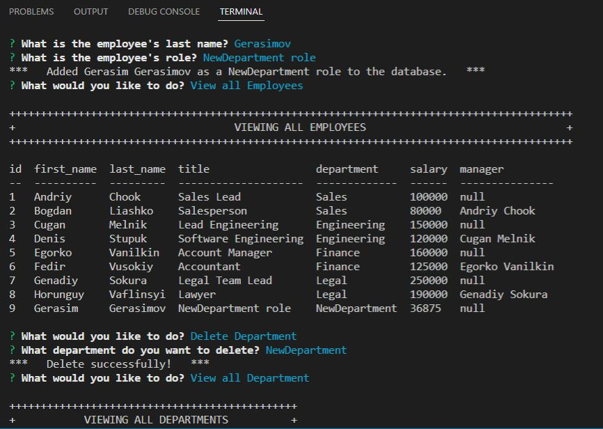

<h># Employee Tracker</h>
# Student Id.
# Oleg Dobrovolskyi

# Repository Link
https://github.com/MrBearSir/EmployeTracker

# Walkthrough Video
https://youtu.be/5fhILd_cGWk

# Project type.
SQL Challenge

# User Story.
AS A business owner 
I WANT to be able to view and manage the departments, roles, and employees in my company 
SO THAT I can organize and plan my business 

# Skills used in development.
<ul>
<li>MySql databases.</li>
<li>Inquirer to get user prompts and interact with databases.</li>
<li>Node.js to connect with database.</li>
<li>dotenv to grant acces to database on local machine.</li>
<li>console.table to display tables from DB.</li>
</ul>